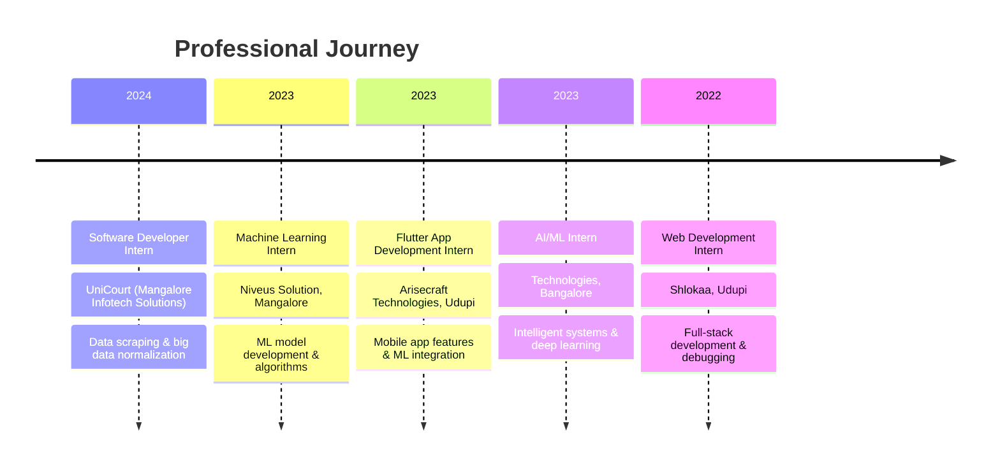
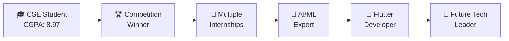

<div align="center">

# 👋 Hi there, I'm Prathviraj Prabhu!
### 🚀 AI/ML Enthusiast | Flutter Developer | CS Student

[](https://git.io/typing-svg)

[](https://luckybug777.github.io)
[](https://prathviraj.vercel.app)
[](https://www.linkedin.com/in/prathvirajprabhu)
[](mailto:prathviz.111@gmail.com)


</div>

---

## 🚀 About Me

```python
class PrathvirajPrabhu:
    def __init__(self):
        self.name = "Prathviraj Prabhu"
        self.location = "Udupi, Karnataka, India"
        self.education = "BE(CSE) at SMVITM (CGPA: 8.97)"
        self.role = "AI/ML Enthusiast & Flutter Developer"
        self.languages = ["English", "Hindi", "Kannada", "Konkani", "Tulu"]
    
    def get_current_focus(self):
        return [
            "🔭 Working on AI/ML projects with GANs and deep learning",
            "🌱 Expanding expertise in cross-platform development",
            "👯 Looking to collaborate on innovative AI projects",
            "💬 Open to discussing ML, Flutter, and tech opportunities"
        ]
    
    def get_achievements(self):
        return {
            "🥇 1st Place": "Unicourt Codefest 2024",
            "🥉 2nd Runner-up": "National Level Hackathon, Coimbatore 2023",
            "🥈 2nd Prize": "State Level Ideathon, SMVITM 2022",
            "📊 CGPA": "8.97/10",
            "🏆 Multiple": "Competition wins and leadership roles"
        }
```

---

## 🛠️ Tech Arsenal

<div align="center">

### 🚀 Mobile Development


### 🌐 Web Development


### 🤖 AI/ML & Data Science


### 🗄️ Databases & Cloud


### 🛠️ Tools & Platforms


</div>

---

## 🌟 Featured Projects

<div align="center">

<table>
<tr>
<td width="50%">

### 🩸 [Rakta-Setu](https://github.com/LuckyBug777/Rakta-Setu)
**Blood Bank Management System**
- 🏥 Comprehensive blood donation platform
- 📱 Built with Flutter & Dart
- 🔍 Advanced donor search by blood group & location
- ⚡ Real-time blood request management

</td>
<td width="50%">

### 🤖 [AI Agent](https://github.com/LuckyBug777/AI-Agent)
**Intelligent AI Assistant**
- 🧠 Advanced AI-powered automation
- 🐍 Built with Python
- 💡 Smart decision-making capabilities
- 🔧 Customizable AI workflows

</td>
</tr>

<tr>
<td width="50%">

### 🏨 [Hotels Platform](https://github.com/LuckyBug777/Hotels)
**Hotel Booking System**
- 🌐 **Live Demo:** [hotels-gules.vercel.app](https://hotels-gules.vercel.app)
- 💻 Modern web interface
- 🛏️ Room booking & management
- 📊 Interactive dashboard

</td>
<td width="50%">

### 🎮 [Retro Games](https://github.com/LuckyBug777/Retro-Games)
**Classic Games Collection**
- 🕹️ Nostalgic game experiences
- 🌐 Web-based gaming platform
- 🎯 Interactive gameplay
- 🎨 Retro-style UI/UX

</td>
</tr>

<tr>
<td width="50%">

### 😷 [Face Mask Prediction](https://github.com/LuckyBug777/Face-Mask-Prediction)
**AI-Powered Mask Detection**
- 👁️ Computer vision & deep learning
- 🎯 Real-time mask detection
- 📊 High accuracy prediction model
- 🛡️ COVID-19 safety compliance

</td>
<td width="50%">

### 📋 [Task API](https://github.com/LuckyBug777/Task-Api)
**RESTful Task Management**
- ⚡ High-performance API
- 🐍 Python backend development
- 📱 Mobile app integration ready
- 🔐 Secure authentication system

</td>
</tr>
</table>

</div>

> 📝 **Note**: I have **33 total repositories** - [View all projects →](https://github.com/LuckyBug777?tab=repositories)

---

## 📊 GitHub Analytics

<div align="center">


</div>

---

## 🏆 Achievements & Recognition

<div align="center">

| 🏅 Achievement | 📅 Year | 🎯 Category |
|:---|:---:|:---|
| **🥇 1st Place** | 2024 | Unicourt Codefest, Problem Solving |
| **🥉 2nd Runner-up** | 2023 | National Level Hackathon, Coimbatore |
| **🥈 2nd Prize** | 2022 | State Level Ideathon, SMVITM |
| **🏅 4th Prize** | 2022 | District Level Project Competition |
| **📚 Academic Excellence** | Ongoing | CGPA 8.97/10 |

</div>

---

## 💼 Professional Experience

<div align="center">



</div>

---

## 🎯 Current Goals & Vision

<div align="center">

### 🔮 What I'm Working On

```python
current_projects = {
    "🤖 Advanced AI": "Exploring GANs and deep learning architectures",
    "📱 Flutter Mastery": "Building cross-platform mobile solutions",
    "🏥 Healthcare Tech": "AI-powered medical applications",
    "🌐 Open Source": "Contributing to the developer community",
    "🎓 Academic Excellence": "Maintaining 8.97+ CGPA while innovating"
}

future_aspirations = [
    "🚀 Lead AI/ML teams in tech giants",
    "💡 Develop breakthrough healthcare AI solutions", 
    "🌍 Create impact through accessible technology",
    "📚 Pursue advanced research in artificial intelligence",
    "🏆 Win more national & international competitions"
]
```

</div>

---

## 🌐 Connect & Collaborate

<div align="center">

### 🤝 Let's Build Something Amazing Together!

[](https://luckybug777.github.io)
[](https://prathviraj.vercel.app)
[](https://www.linkedin.com/in/prathvirajprabhu)
[](mailto:prathviz.111@gmail.com)

### 💡 Open to discussing:
**AI/ML Projects** • **Flutter Development** • **Tech Collaborations** • **Internship Opportunities**

---

### 🛤️ My Journey So Far



</div>

---

## 🎨 Fun Facts About Me

<div align="center">

| 🌟 | About |
|:---:|:---|
| 🧠 | I speak **5 languages**: English, Hindi, Kannada, Konkani, Tulu |
| 🏆 | **Competition enthusiast** - Love solving complex problems under pressure |
| 🤖 | **AI visionary** - Believe AI will revolutionize healthcare & education |
| 🌱 | **Continuous learner** - Always exploring new technologies and frameworks |
| 🎯 | **Goal-oriented** - Set ambitious targets and consistently achieve them |
| 💡 | **Innovation driver** - Hosted Hackotsav 2k24, first offline National Hackathon |

</div>

---

<div align="center">

### 💭 My Philosophy

> *"Innovation distinguishes between a leader and a follower."* - Steve Jobs

**🚀 Always pushing boundaries • 💡 Turning ideas into reality • 🌟 Creating impact through technology**

---

### 📫 Ready to Collaborate?

**Whether you're interested in AI/ML projects, Flutter development, or just want to discuss the latest tech trends, I'm always excited to connect with fellow innovators and problem solvers!**

[](https://github.com/piyushsuthar/github-readme-quotes)

---

<sub>⭐ **Star my repositories if you find them interesting!** | 🔄 **Last updated: June 2025** | 🤖 **Built with passion for technology**</sub>

</div>
